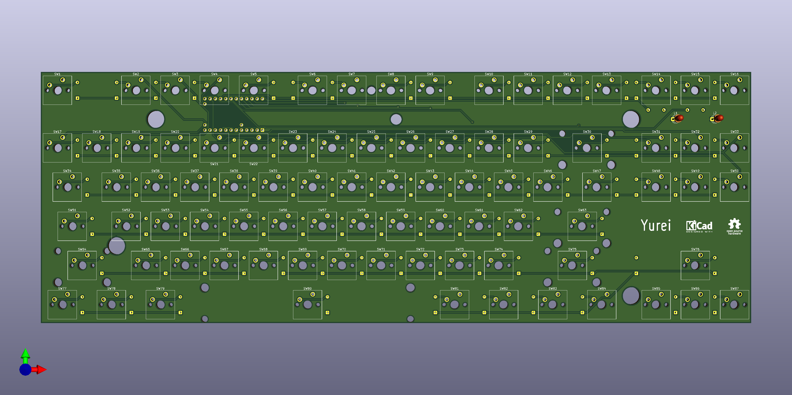
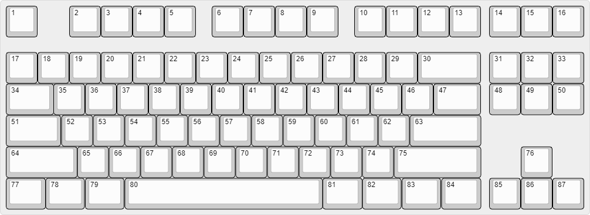

# Yurei
A Tenkeyless PCB inspired by Phantom designed for customizing Filco Majestouch 2.

## Features
 * QMK Firmware
 * Teensy 2.0 controller
 * Minimal layout support
 * No switch LEDs and no underglow
 * All switches are south facing
 * Compatible with Filco Majestouch 2 case
 * Designed with KiCAD 5.1.4

## Supported Layouts
 * ANSI

 

## Supported Switches
 * Cherry MX and Cherry MX style switches

## Supported Cases
 * Filco Majestouch 2

### Note
 * [A bit modification to Filco case](images/bottom-case-mod.png) is required to install the USB cable.
 * Some other keyboard cases may also be compatible, but they have not been tested.
 * [YMDK aluminum case is not compatible](images/filco-pcb-and-ymdk-case-problem.pdf) (almost good but plate and pcb are slightly too thick, so that it causes a gap between the top and bottom cases).
   * Genuine filco PCBs and phantom PCBs also have the same problem.
   * I'm designing a new concept PCB named [Wallaby](https://github.com/kkatano/wallaby) to solve this problem. 

## BOM

| Reference | Description | Value     |URL                                                                                                      | Qty | 
|-----------|-------------|-----------|---------------------------------------------------------------------------------------------------------|-----| 
| D1-D87    | Diode       | 1N4148    |https://www.digikey.jp/product-detail/en/on-semiconductor/1N4148/1N4148FS-ND/458603                      | 87  | 
| L1, L2    | LED         | LED       |https://www.digikey.jp/product-detail/en/vishay-semiconductor-opto-division/VLHW4100/751-1502-ND/2403143 | 2   | 
| R1, R2    | Resistor    | 10k       |https://www.digikey.jp/product-detail/en/yageo/MFR-25FBF52-10K/10.0KXBK-ND/13219                         | 2   | 
| SW1-SW87  | Key switch  | Cherry MX |                                                                                                         | 87  | 
| U1        | Controller  | Teensy2.0 |https://www.pjrc.com/store/teensy.html                                                                   | 1   | 

You also need following parts to build keyboard.

 * [LED spacer](https://www.digikey.jp/product-detail/en/keystone-electronics/7362/36-7362-ND/316720)
   * 2 pieces
 * Stabilizers
   * 4 x 2u and 1 x 6.25u
 * Plate
 * Case
 * USB mini-B cable

## Firmware

https://github.com/qmk/qmk_firmware/tree/master/keyboards/yurei

## Lisence

Yurei is released under the MIT License.

## Credits

### [The Phantom](http://bathroomepiphanies.com/keyboards/phantom/)

Source of inspiration.

### Teensy library for KiCAD

Teensy symbol and footprint are based on XenGi's libraries released under the MIT license.

#### [teensy_library](https://github.com/XenGi/teensy_library)

Copyright (c) 2015 Ricardo Band  
https://github.com/XenGi/teensy_library/blob/master/LICENSE 

#### [teensy.pretty](https://github.com/XenGi/teensy.pretty)

Copyright (c) 2015 Ricardo Band  
https://github.com/XenGi/teensy.pretty/blob/master/LICENSE

### [KiCad Libraries](https://kicad-pcb.org/libraries/)

All symbols and footprints except Teensy are based on The KiCad libraries.

### [Keyboard Layouter Plugin](https://github.com/yskoht/keyboard-layouter)

Handy plugin to place the switches.

### [keyboard-layout-editor.com](http://www.keyboard-layout-editor.com/)

Used to generate keyboard layout data to be input to Keyboard Layouter.

### [FreeRouting](https://freerouting.org/)

Good starting point for routing.
